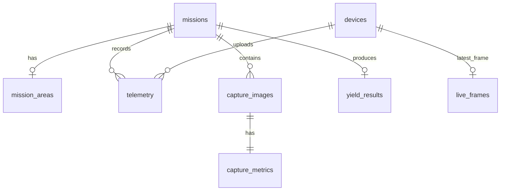

# 姘寸ɑ浜ч噺棰勬祴绯荤粺鎶€鏈鏄庢枃妗?
鐗堟湰锛歷1.3.1.20260612.beta  
鏃ユ湡锛?026-06-18  
绯荤粺瀹氫綅锛氬凡閮ㄧ讲杩愯鐨勭函鏃犱汉鏈烘按绋讳骇閲忛娴嬪悗鍙扮郴缁?
## 1. 绯荤粺姒傝堪

姘寸ɑ浜ч噺棰勬祴绯荤粺鏄竴濂楅潰鍚戞按绋荤敯鍧楁棤浜烘満娴嬩骇浠诲姟鐨勭敓浜у瀷鍚庡彴绯荤粺銆傜郴缁熶互鏃犱汉鏈轰綆绌洪仴鎰熷浘鍍忋€侀鎺ч仴娴嬫暟鎹拰浠诲姟鍖哄煙淇℃伅涓烘牳蹇冩暟鎹潵婧愶紝缁撳悎浜戠鏁版嵁搴撳拰娴忚鍣ㄥぇ灞忥紝瀹炵幇浠诲姟瑙勫垝銆佹棤浜烘満鐘舵€佺洃娴嬨€佸浘鍍忛噰闆嗙鐞嗐€佺儹鍔涘浘灞曠ず銆佹祴浜ф寚鏍囧瓨鍌ㄥ拰鎬讳骇閲忎及绠椼€?
褰撳墠绯荤粺閲囩敤绾棤浜烘満娴嬩骇妯″紡锛屼笉鍐嶄緷璧栧湴闈㈢閲囨牱璁惧銆傛棤浜烘満绔礋璐ｆ墽琛岄琛屼换鍔°€侀噰闆嗗浘鍍忋€佸洖浼犲疄鏃剁敾闈㈠拰閬ユ祴鏁版嵁锛涗簯鏈嶅姟鍣ㄨ礋璐ｆ暟鎹帴鏀躲€佸瓨鍌ㄣ€佽绠楀拰鎺ュ彛鏈嶅姟锛涚鐞嗗憳閫氳繃鍔炲叕瀹ょ數鑴戞祻瑙堝櫒璁块棶鍚庡彴澶у睆锛屽畬鎴愪换鍔＄鐞嗐€佹暟鎹煡鐪嬪拰缁撴灉鍒嗘瀽銆?
绯荤粺宸茬粡閮ㄧ讲鍦ㄩ樋閲屼簯 ECS 鏈嶅姟鍣紝閲囩敤 Docker Compose 绠＄悊鍓嶇銆佸悗绔拰鏁版嵁搴撴湇鍔★紝鏀寔閫氳繃鏈嶅姟鍣?IP 杩涜璁块棶銆?
## 2. 绯荤粺鎬讳綋鏋舵瀯

绯荤粺閲囩敤鈥滄棤浜烘満绔?+ 浜戞湇鍔″櫒 + 娴忚鍣ㄥぇ灞忊€濈殑涓夊眰鏋舵瀯銆?
```mermaid
flowchart LR
  A["鏃犱汉鏈虹 Jetson / ROS2"] --> B["FastAPI 鍚庣 API"]
  A --> C["Sony 瀹炴椂鐢婚潰 / 閲囬泦鍥惧儚涓婁紶"]
  C --> B
  B --> D["MySQL 鏁版嵁搴?]
  B --> E["鏈嶅姟鍣?uploads 鏂囦欢瀛樺偍"]
  F["绠＄悊鍛樺姙鍏鐢佃剳"] --> G["Nginx 鍓嶇鏈嶅姟"]
  G --> B
  G --> H["DJI 寤烘ā鍦板浘鐡︾墖 / 鐑姏鍥剧摝鐗?]
```

### 2.1 鏃犱汉鏈虹

鏃犱汉鏈虹鍩轰簬 Jetson 璁＄畻鏈哄拰 ROS2 宸ヤ綔鍖鸿繍琛岋紝涓昏璐熻矗锛?
- 閫氳繃 MAVROS 鑾峰彇椋炴帶閬ユ祴鏁版嵁锛?- 鑾峰彇鏃犱汉鏈哄Э鎬併€侀€熷害銆佸姞閫熷害銆佺數閲忋€侀琛屾ā寮忋€佸畾浣嶈川閲忓拰鍗槦鏁帮紱
- 鑾峰彇 Sony 鐩告満瀹炴椂鐢婚潰锛?- 灏?ARW 鏍煎紡鍥惧儚杞崲涓?JPG 鍚庝笂浼狅紱
- 涓婁紶閲囬泦鍥惧儚銆丟PS 鍧愭爣銆佷换鍔＄紪鍙峰拰娴嬩骇鎸囨爣锛?- 灏嗗疄鏃剁敾闈互 JPEG 甯ф柟寮忔寔缁笂浼犲埌鏈嶅姟鍣ㄣ€?
### 2.2 浜戞湇鍔″櫒绔?
浜戞湇鍔″櫒绔敱 Docker Compose 绠＄悊锛屽寘鍚笁涓富瑕佹湇鍔★細

| 鏈嶅姟 | 鎶€鏈?| 浣滅敤 |
|---|---|---|
| `nginx` | Nginx 1.27 | 鎻愪緵鍓嶇闈欐€侀〉闈€佸湴鍥剧摝鐗囪祫婧愶紝骞跺弽鍚戜唬鐞?API |
| `api` | FastAPI | 鎻愪緵浠诲姟銆佸浘鍍忋€侀仴娴嬨€佷及浜с€佺櫥褰曡璇佺瓑鍚庣鎺ュ彛 |
| `mysql` | MySQL 8.0 | 鎸佷箙鍖栦繚瀛樹换鍔°€佸尯鍩熴€侀仴娴嬨€佸浘鍍忋€佹寚鏍囧拰浼颁骇缁撴灉 |

Nginx 瀵瑰寮€鏀?80 绔彛锛屾祻瑙堝櫒璁块棶鏈嶅姟鍣?IP 鍗冲彲杩涘叆绯荤粺銆傚悗绔?API 杩愯鍦ㄥ鍣ㄥ唴閮紝閫氳繃 Nginx 浠ｇ悊鏆撮湶 `/api/*` 璺緞銆備笂浼犲浘鍍忓拰瀹炴椂鐢婚潰淇濆瓨鍦ㄦ湇鍔″櫒鎸傝浇鐩綍 `/data/uploads` 涓紝鏁版嵁搴撲繚瀛樻枃浠?URL 鍜岀储寮曚俊鎭€?
### 2.3 娴忚鍣ㄥぇ灞忕

娴忚鍣ㄧ鏄郴缁熺殑涓昏浜や簰鐣岄潰锛屾彁渚涳細

- 绠＄悊鍛樼櫥褰曪紱
- 浠诲姟閫夋嫨銆佹柊寤恒€佷慨鏀广€佸垹闄わ紱
- 澶╂皵銆佹椂闂村拰绯荤粺鐘舵€佸睍绀猴紱
- DJI 寤烘ā鍦板浘灞曠ず锛?- 浠诲姟鍖哄煙璁剧疆锛?- 鏃犱汉鏈轰换鍔＄敓鎴愬拰鍔犺浇锛?- 鏃犱汉鏈哄疄鏃剁姸鎬併€佸疄鏃剁敾闈㈠拰濮挎€佹ā鍨嬶紱
- 閲囬泦鐐广€佸浘鍍忋€佺儹鍔涘浘鍜屼及浜х粨鏋滃睍绀猴紱
- 閲囬泦鐐规壒閲忕鐞嗗拰鍥惧儚瀵煎嚭銆?
## 3. 绯荤粺鏁版嵁娴?
### 3.1 瀹炴椂閬ユ祴鏁版嵁娴?
鏃犱汉鏈虹閫氳繃 ROS2/MAVROS 鑾峰彇椋炴帶鏁版嵁锛岀敱瀹炴椂涓婁紶鑺傜偣鍙戦€佽嚦鍚庣锛?
```text
椋炴帶 / MAVROS
  -> Jetson ROS2 鑺傜偣
  -> POST /api/telemetry
  -> telemetry 琛?  -> 鍓嶇 /api/telemetry/latest銆?api/telemetry/path
```

閬ユ祴鏁版嵁鍖呮嫭锛?
- 缁忓害銆佺含搴︼紱
- 楂樺害锛?- 涓夎酱閫熷害锛?- 涓夎酱鍔犻€熷害锛?- 鐢甸噺锛?- 椋炶妯″紡锛?- 閾捐矾妯″紡锛?- 淇″彿寮哄害锛?- GPS/RTK 瀹氫綅璐ㄩ噺锛?- 鍗槦鏁帮紱
- 宸插畬鎴愭媿鎽勭偣鏁伴噺锛?- 鏃犱汉鏈虹姸鎬併€?
### 3.2 瀹炴椂鐢婚潰鏁版嵁娴?
Sony 鐩告満瀹炴椂鐢婚潰鐢?Jetson 绔鍙栧苟鍘嬬缉涓?JPEG 甯э紝閫氳繃鎺ュ彛涓婁紶锛?
```text
Sony LiveView
  -> Jetson 瀹炴椂鐢婚潰妗ユ帴鑺傜偣
  -> POST /api/live-frame
  -> uploads/live/UAV-001.jpg
  -> live_frames 琛?  -> 鍓嶇瀹炴椂棰勮绐楀彛
```

绯荤粺鍙繚瀛樻瘡鍙版棤浜烘満鐨勬渶鏂板疄鏃剁敾闈㈠抚锛屼笉淇濆瓨鍘嗗彶瑙嗛甯э紝浠庤€岄檷浣庢湇鍔″櫒纾佺洏鍜屾暟鎹簱鍘嬪姏銆?
### 3.3 閲囬泦鍥惧儚鏁版嵁娴?
鏃犱汉鏈烘媿鐓у悗锛孞etson 绔畬鎴愬浘鍍忚浆鎹笌涓婁紶锛?
```text
Sony A7C2 鍘熷鍥惧儚
  -> ARW 杞?JPG
  -> 鎻愬彇 GPS / 浠诲姟缂栧彿 / 鏃堕棿
  -> POST /api/capture-images
  -> uploads 鏂囦欢鐩綍
  -> capture_images + capture_metrics 琛?  -> 鍦板浘閲囬泦鐐?/ 鍥惧儚鏌ョ湅 / 鐑姏鍥?```

閲囬泦鍥惧儚涓婁紶鍚庯紝鍚庣浼氬悓鏃跺缓绔嬪搴旂殑娴嬩骇鎸囨爣璁板綍銆傚鏋滆澶囩涓婁紶浜嗙湡瀹炴寚鏍囷紝鍒欎繚瀛樿澶囩鎸囨爣锛涘鏋滄殏鏃舵湭涓婁紶鎸囨爣锛屽垯绯荤粺鐢熸垚榛樿鎸囨爣锛屼繚璇佸墠绔彲浠ョǔ瀹氬睍绀恒€?
### 3.4 浼颁骇缁撴灉鏁版嵁娴?
绯荤粺鏍规嵁褰撳墠浠诲姟鐨勯噰闆嗘寚鏍囥€佷换鍔￠潰绉拰瀹屾垚杩涘害璁＄畻浠诲姟绾т及浜х粨鏋滐細

```text
浠诲姟鍖哄煙闈㈢Н + 閲囬泦鐐规寚鏍?+ 瀹屾垚鎷嶆憚杩涘害
  -> 鍚庣 rebuild_yield_result()
  -> yield_results 琛?  -> 鍓嶇 KPI 鍜屼换鍔¤繘搴﹀睍绀?```

褰撳墠鎬讳骇閲忚绠楅€昏緫涓猴細

```text
鎬讳骇閲?= 骞冲潎浜╀骇 脳 瑕嗙洊闈㈢Н 脳 浠诲姟瀹屾垚姣斾緥
```

浠诲姟瀹屾垚姣斾緥浼樺厛浣跨敤椋炴帶鍥炰紶鐨?`completed_shot_count`銆傚鏋滈鎺ф殏鏈洖浼犲畬鎴愭媿鎽勭偣鏁伴噺锛屽垯浣跨敤褰撳墠浠诲姟宸查噰闆嗙偣鏁伴噺浣滀负鍏滃簳銆?
## 4. 绯荤粺鍔熻兘缁撴瀯

```mermaid
flowchart TB
  S["姘寸ɑ浜ч噺棰勬祴绯荤粺"] --> A["鐧诲綍涓庢潈闄愭ā鍧?]
  S --> B["浠诲姟绠＄悊妯″潡"]
  S --> C["鍦板浘涓庝换鍔″尯鍩熸ā鍧?]
  S --> D["鏃犱汉鏈虹姸鎬佺洃娴嬫ā鍧?]
  S --> E["鍥惧儚閲囬泦绠＄悊妯″潡"]
  S --> F["娴嬩骇鎸囨爣涓庣儹鍔涘浘妯″潡"]
  S --> G["浜ч噺浼扮畻妯″潡"]
  S --> H["瀹炴椂鐢婚潰妯″潡"]

  A --> A1["楠岃瘉鐮佺櫥褰?]
  A --> A2["Cookie 浼氳瘽"]
  A --> A3["閫€鍑虹櫥褰?]

  B --> B1["閫夋嫨鍘嗗彶浠诲姟"]
  B --> B2["鏂板缓浠诲姟"]
  B --> B3["淇敼浠诲姟鍚?]
  B --> B4["鍒犻櫎浠诲姟"]

  C --> C1["璁剧疆浠诲姟鍖哄煙"]
  C --> C2["鑷姩璁＄畻闈㈢Н"]
  C --> C3["鐢熸垚鏃犱汉鏈轰换鍔?]
  C --> C4["鍔犺浇浠诲姟鍒版棤浜烘満"]
  C --> C5["鏄剧ず鑸嚎鍜岄噰闆嗙偣"]

  D --> D1["鏃犱汉鏈虹紪鍙?]
  D --> D2["鐢甸噺鏉?]
  D --> D3["椋炶妯″紡"]
  D --> D4["楂樺害"]
  D --> D5["涓夎酱閫熷害"]
  D --> D6["涓夎酱鍔犻€熷害"]
  D --> D7["GPS/RTK 涓庡崼鏄熸暟"]
  D --> D8["濮挎€佹ā鍨?]

  E --> E1["涓婁紶閲囬泦鍥剧墖"]
  E --> E2["鎸変换鍔″垏鎹㈠浘鐗?]
  E --> E3["鏌ョ湅澶у浘"]
  E --> E4["瀵煎嚭鍥惧儚"]
  E --> E5["鏇存敼鎵€灞炰换鍔?]
  E --> E6["鎵归噺绠＄悊"]

  F --> F1["浜╀骇閲?]
  F --> F2["绌楀瘑搴?]
  F --> F3["绌楄鐩栫巼"]
  F --> F4["鏍珮"]
  F --> F5["浠诲姟鍖哄煙鍐呯儹鍔涘浘"]

  G --> G1["骞冲潎浜╀骇"]
  G --> G2["瑕嗙洊闈㈢Н"]
  G --> G3["浠诲姟杩涘害"]
  G --> G4["鎬讳骇閲?]
```

## 5. 鍔熻兘妯″潡璇存槑

### 5.1 鐧诲綍涓庢潈闄愭ā鍧?
绯荤粺鎻愪緵姝ｅ紡鍚庡彴鐧诲綍椤碉紝绠＄悊鍛樹娇鐢ㄨ处鍙峰瘑鐮佸拰楠岃瘉鐮佺櫥褰曘€傜櫥褰曟垚鍔熷悗锛屽悗绔啓鍏?HttpOnly Cookie锛屽墠绔埛鏂伴〉闈㈠悗浠嶅彲淇濇寔浼氳瘽銆?
榛樿绠＄悊鍛樿处鍙风敱鐜鍙橀噺閰嶇疆锛?
| 鐜鍙橀噺 | 榛樿鍊?| 璇存槑 |
|---|---|---|
| `ADMIN_USERNAME` | `admin` | 绠＄悊鍛樼敤鎴峰悕 |
| `ADMIN_PASSWORD` | `admin` | 绠＄悊鍛樺瘑鐮?|
| `AUTH_SECRET` | `yield-system-change-me` | Cookie 绛惧悕瀵嗛挜 |

绠＄悊绫绘帴鍙ｉ渶瑕佺櫥褰曞悗璁块棶锛岃澶囦笂浼犵被鎺ュ彛涓嶅己鍒剁櫥褰曪紝閬垮厤鏃犱汉鏈鸿嚜鍔ㄥ洖浼犳暟鎹彈鍒扮鐞嗗憳浼氳瘽褰卞搷銆?
### 5.2 浠诲姟绠＄悊妯″潡

浠诲姟绠＄悊妯″潡鏀寔锛?
- 閫夋嫨鍘嗗彶浠诲姟锛?- 鏂板缓浠诲姟锛?- 淇敼浠诲姟鍚嶏紱
- 鍒犻櫎浠诲姟锛?- 鎸変换鍔″垏鎹㈤噰闆嗗浘鍍忓拰浼颁骇缁撴灉锛?- 淇濆瓨浠诲姟鍖哄煙銆侀潰绉拰璁″垝鎷嶆憚鐐规暟銆?
浠诲姟鍚嶇О鍜屼换鍔″尯鍩熷潎淇濆瓨鍦ㄦ暟鎹簱涓紝鍒锋柊椤甸潰鍚庝笉浼氫涪澶便€?
### 5.3 鍦板浘涓庝换鍔″尯鍩熸ā鍧?
鍦板浘妯″潡浣跨敤鏈湴 DJI 寤烘ā鍦板浘鐡︾墖锛屼笉渚濊禆鍦ㄧ嚎鍦板浘鏈嶅姟銆傜郴缁熸敮鎸佸湪鍦板浘涓婅缃换鍔″尯鍩燂紝绠＄悊鍛樹緷娆＄偣鍑昏竟鐣岀偣鍚庯紝绯荤粺鑷姩鍥村悎澶氳竟褰㈠尯鍩熷苟璁＄畻瑕嗙洊闈㈢Н銆?
浠诲姟鍖哄煙纭鍚庯紝绯荤粺鍙牴鎹綋鍓嶄换鍔℃ā鏉跨敓鎴愭棤浜烘満鑸嚎鍜屾媿鎽勭偣銆傚綋鍓嶄换鍔″尯鍩熴€侀潰绉€佽竟鐣岀偣銆佽鍒掔偣鍜岃鍒掓媿鎽勭偣鏁伴噺鍧囦繚瀛樺埌 `mission_areas` 琛ㄣ€?
### 5.4 鏃犱汉鏈虹姸鎬佺洃娴嬫ā鍧?
鍙充晶鏃犱汉鏈鸿鎯呴潰鏉垮睍绀哄綋鍓嶆棤浜烘満鐨勫疄鏃剁姸鎬侊紝鍖呮嫭锛?
- 鏃犱汉鏈虹紪鍙凤紱
- 鐢甸噺鏉★紱
- 椋炶妯″紡锛?- 楂樺害锛?- 涓夎酱閫熷害锛?- 涓夎酱鍔犻€熷害锛?- GPS/RTK 瀹氫綅璐ㄩ噺锛?- 鍗槦鏁帮紱
- 濮挎€佹ā鍨嬶紱
- 瀹炴椂鐢婚潰锛?- 鎵ц浠诲姟涓庤繑鑸寜閽€?
鍓嶇閫氳繃 `/api/telemetry/latest` 鍛ㄦ湡鎬ц幏鍙栨渶鏂扮姸鎬侊紝閫氳繃 `/api/telemetry/path` 鑾峰彇鏃犱汉鏈鸿矾寰勫苟鍦ㄥ湴鍥句笂灞曠ず銆?
### 5.5 鍥惧儚閲囬泦绠＄悊妯″潡

閲囬泦鍥惧儚涓婁紶鍚庯紝绯荤粺鍦ㄥ湴鍥句腑浠ラ噰闆嗙偣褰㈠紡灞曠ず銆傛瘡涓噰闆嗙偣瀵瑰簲涓€寮犳垨澶氬紶鍥惧儚锛岀偣鍑婚噰闆嗙偣鍙互鏌ョ湅澶у浘骞跺鍑哄浘鍍忋€?
绯荤粺鏀寔锛?
- 鎸変换鍔℃煡璇㈠浘鍍忥紱
- 鐐瑰嚮閲囬泦鐐规煡鐪嬪浘鍍忥紱
- 瀵煎嚭閲囬泦鍥惧儚锛?- 淇敼鍗曚釜閲囬泦鐐规墍灞炰换鍔★紱
- 鎵归噺淇敼閲囬泦鐐规墍灞炰换鍔★紱
- 鎵归噺鍒犻櫎閲囬泦鐐广€?
鍥惧儚鏂囦欢淇濆瓨鍦ㄦ湇鍔″櫒 `uploads/` 鐩綍锛屾暟鎹簱鍙繚瀛樺浘鐗?URL銆佸潗鏍囥€佷换鍔＄紪鍙峰拰鎸囨爣淇℃伅銆?
### 5.6 娴嬩骇鎸囨爣涓庣儹鍔涘浘妯″潡

褰撳墠绯荤粺灞曠ず绾棤浜烘満娴嬩骇鐩稿叧鎸囨爣锛?
- 浜╀骇閲忥紱
- 绌楀瘑搴︼紱
- 绌楄鐩栫巼锛?- 鏍珮銆?
鐑姏鍥惧彧鍦ㄤ换鍔″尯鍩熷唴灞曠ず锛岄鑹叉繁娴呰〃绀烘寚鏍囨暟鍊煎ぇ灏忋€傜鐞嗗憳鐐瑰嚮涓嶅悓鎸囨爣鎸夐挳鍚庯紝鍦板浘鐑姏鍥鹃殢涔嬪垏鎹€傞紶鏍囨偓鍋滈噰闆嗙偣鏃讹紝绯荤粺鏄剧ず璇ラ噰闆嗙偣瀵瑰簲鐨勬祴浜ф寚鏍囥€?
### 5.7 浜ч噺浼扮畻妯″潡

浼颁骇妯″潡鍩轰簬閲囬泦鐐规寚鏍囧拰浠诲姟瑕嗙洊闈㈢Н璁＄畻鎬讳骇閲忋€傚悗绔皢姣忎釜浠诲姟鐨勪及浜х粨鏋滀繚瀛樿嚦 `yield_results` 琛ㄣ€?
涓昏杈撳嚭鍖呮嫭锛?
- 骞冲潎浜╀骇锛?- 瑕嗙洊闈㈢Н锛?- 閲囬泦鐐规暟閲忥紱
- 璁″垝鎷嶆憚鐐规暟閲忥紱
- 宸插畬鎴愭媿鎽勭偣鏁伴噺锛?- 浠诲姟瀹屾垚姣斾緥锛?- 浼版祴鎬讳骇閲忥紱
- 缃俊搴︺€?
## 6. 鏁版嵁搴撹璁?
鏁版嵁搴撳悕绉扮敱鐜鍙橀噺 `MYSQL_DATABASE` 鎸囧畾锛岄粯璁ら儴缃蹭娇鐢?MySQL 8.0銆傚悗绔惎鍔ㄦ椂浼氭墽琛?`ensure_schema()`锛岃嚜鍔ㄥ垱寤虹己澶辫〃锛屽苟瀵规棫琛ㄨˉ鍏呮柊澧炲瓧娈点€?
### 6.1 琛ㄧ粨鏋勬€昏

| 琛ㄥ悕 | 璇存槑 |
|---|---|
| `missions` | 浠诲姟鍩虹淇℃伅 |
| `mission_areas` | 浠诲姟鍖哄煙銆侀潰绉€佽鍒掔偣鍜岃鍒掓媿鎽勭偣 |
| `devices` | 鏃犱汉鏈鸿澶囦俊鎭?|
| `telemetry` | 鏃犱汉鏈洪仴娴嬩笌璺緞鏁版嵁 |
| `capture_images` | 閲囬泦鍥惧儚璁板綍 |
| `capture_metrics` | 閲囬泦鍥惧儚瀵瑰簲鐨勬祴浜ф寚鏍?|
| `yield_results` | 浠诲姟绾т及浜х粨鏋?|
| `live_frames` | 姣忓彴鏃犱汉鏈烘渶鏂板疄鏃剁敾闈㈣褰?|

### 6.2 鏁版嵁琛ㄥ叧绯?


### 6.3 missions 琛?
鐢ㄤ簬淇濆瓨浠诲姟鍩虹淇℃伅銆?
| 瀛楁 | 绫诲瀷 | 璇存槑 |
|---|---|---|
| `id` | BIGINT | 涓婚敭 |
| `mission_code` | VARCHAR(64) | 浠诲姟缂栧彿锛屽敮涓€ |
| `field_name` | VARCHAR(128) | 浠诲姟鍚嶇О鎴栫敯鍧楀悕绉?|
| `status` | VARCHAR(32) | 浠诲姟鐘舵€?|
| `created_at` | TIMESTAMP | 鍒涘缓鏃堕棿 |
| `updated_at` | TIMESTAMP | 鏇存柊鏃堕棿 |

### 6.4 mission_areas 琛?
鐢ㄤ簬淇濆瓨浠诲姟鍖哄煙鍜岃鍒掍俊鎭€?
| 瀛楁 | 绫诲瀷 | 璇存槑 |
|---|---|---|
| `mission_code` | VARCHAR(64) | 浠诲姟缂栧彿锛屽敮涓€ |
| `area_mu` | DECIMAL(10,3) | 鍖哄煙闈㈢Н锛屽崟浣嶄憨 |
| `confirmed` | BOOLEAN | 鏄惁纭鍖哄煙 |
| `boundary_json` | JSON | 杈圭晫鐐规暟缁?|
| `planned_points_json` | JSON | 瑙勫垝閲囬泦鐐规暟缁?|
| `planned_shot_count` | INT | 璁″垝鎷嶆憚鐐规暟閲?|

### 6.5 devices 琛?
鐢ㄤ簬淇濆瓨鏃犱汉鏈鸿澶囧熀纭€鐘舵€併€?
| 瀛楁 | 绫诲瀷 | 璇存槑 |
|---|---|---|
| `device_code` | VARCHAR(64) | 璁惧缂栧彿 |
| `device_type` | ENUM | 璁惧绫诲瀷锛屽綋鍓嶄富瑕佷娇鐢?`uav` |
| `name` | VARCHAR(128) | 璁惧鍚嶇О |
| `battery_level` | INT | 鐢甸噺 |
| `online` | BOOLEAN | 鏄惁鍦ㄧ嚎 |
| `last_lng` | DECIMAL | 鏈€鍚庣粡搴?|
| `last_lat` | DECIMAL | 鏈€鍚庣含搴?|

### 6.6 telemetry 琛?
鐢ㄤ簬淇濆瓨鏃犱汉鏈哄疄鏃堕仴娴嬪拰璺緞鏁版嵁銆?
| 瀛楁 | 绫诲瀷 | 璇存槑 |
|---|---|---|
| `device_id` | BIGINT | 鍏宠仈璁惧 |
| `mission_code` | VARCHAR(64) | 鎵€灞炰换鍔?|
| `lng` / `lat` | DECIMAL | 缁忕含搴?|
| `altitude` | DECIMAL | 楂樺害 |
| `speed` | DECIMAL | 閫熷害 |
| `vx` / `vy` / `vz` | DECIMAL | 涓夎酱閫熷害 |
| `ax` / `ay` / `az` | DECIMAL | 涓夎酱鍔犻€熷害 |
| `roll` / `pitch` / `yaw` | DECIMAL | 濮挎€佽 |
| `flight_mode` | VARCHAR | 椋炶妯″紡 |
| `link_mode` | VARCHAR | 閾捐矾妯″紡 |
| `signal_strength` | DECIMAL | 淇″彿寮哄害 |
| `positioning_quality` | VARCHAR | 瀹氫綅璐ㄩ噺 |
| `satellite_count` | INT | 鍗槦鏁?|
| `completed_shot_count` | INT | 宸插畬鎴愭媿鎽勭偣鏁伴噺 |
| `battery_level` | INT | 鐢甸噺 |
| `status` | VARCHAR | 鐘舵€?|
| `created_at` | TIMESTAMP | 涓婁紶鏃堕棿 |

### 6.7 capture_images 琛?
鐢ㄤ簬淇濆瓨閲囬泦鍥惧儚绱㈠紩銆?
| 瀛楁 | 绫诲瀷 | 璇存槑 |
|---|---|---|
| `device_type` | ENUM | 璁惧绫诲瀷 |
| `device_code` | VARCHAR(64) | 璁惧缂栧彿 |
| `mission_code` | VARCHAR(64) | 鎵€灞炰换鍔?|
| `title` | VARCHAR(255) | 鍥剧墖鏍囬 |
| `image_url` | VARCHAR(512) | 鍥剧墖璁块棶璺緞 |
| `lng` / `lat` | DECIMAL | 鎷嶆憚浣嶇疆 |
| `captured_at` | TIMESTAMP | 鎷嶆憚鏃堕棿 |
| `created_at` | TIMESTAMP | 鍏ュ簱鏃堕棿 |

### 6.8 capture_metrics 琛?
鐢ㄤ簬淇濆瓨姣忓紶鍥惧儚瀵瑰簲鐨勬祴浜ф寚鏍囥€?
| 瀛楁 | 绫诲瀷 | 璇存槑 |
|---|---|---|
| `capture_image_id` | BIGINT | 鍏宠仈閲囬泦鍥惧儚 |
| `panicle_coverage` | DECIMAL | 绌楄鐩栫巼 |
| `plant_height_cm` | DECIMAL | 鏍珮 |
| `panicle_density` | DECIMAL | 绌楀瘑搴?|
| `yield_per_mu` | DECIMAL | 浜╀骇閲?|
| `grain_count` | DECIMAL | 姣忕璋风矑鏁帮紝淇濈暀鎵╁睍 |
| `grain_volume` | DECIMAL | 姣忕璋风矑浣撶Н锛屼繚鐣欐墿灞?|
| `source` | VARCHAR | 鎸囨爣鏉ユ簮 |

### 6.9 yield_results 琛?
鐢ㄤ簬淇濆瓨浠诲姟绾т及浜х粨鏋溿€?
| 瀛楁 | 绫诲瀷 | 璇存槑 |
|---|---|---|
| `mission_code` | VARCHAR(64) | 浠诲姟缂栧彿 |
| `avg_yield_per_mu` | DECIMAL | 骞冲潎浜╀骇 |
| `area_mu` | DECIMAL | 浠诲姟闈㈢Н |
| `capture_point_count` | INT | 閲囬泦鐐规暟閲?|
| `planned_shot_count` | INT | 璁″垝鎷嶆憚鐐规暟閲?|
| `completed_shot_count` | INT | 宸插畬鎴愭媿鎽勭偣鏁伴噺 |
| `progress_ratio` | DECIMAL | 浠诲姟瀹屾垚姣斾緥 |
| `fusion_yield_ton` | DECIMAL | 浼版祴鎬讳骇閲?|
| `uav_yield_ton` | DECIMAL | 鏃犱汉鏈轰及娴嬩骇閲?|
| `confidence` | DECIMAL | 缃俊搴?|

### 6.10 live_frames 琛?
鐢ㄤ簬璁板綍姣忓彴鏃犱汉鏈虹殑鏈€鏂板疄鏃剁敾闈€?
| 瀛楁 | 绫诲瀷 | 璇存槑 |
|---|---|---|
| `device_code` | VARCHAR(64) | 鏃犱汉鏈虹紪鍙?|
| `mission_code` | VARCHAR(64) | 褰撳墠浠诲姟 |
| `image_url` | VARCHAR(512) | 鏈€鏂扮敾闈?URL |
| `captured_at` | TIMESTAMP | 鐢婚潰閲囬泦鏃堕棿 |
| `updated_at` | TIMESTAMP | 鏇存柊鏃堕棿 |

## 7. API 璁捐

### 7.1 璁よ瘉鎺ュ彛

| 鎺ュ彛 | 鏂规硶 | 璇存槑 | 鏄惁鐧诲綍 |
|---|---|---|---|
| `/api/auth/captcha` | GET | 鑾峰彇楠岃瘉鐮?| 鍚?|
| `/api/auth/login` | POST | 绠＄悊鍛樼櫥褰?| 鍚?|
| `/api/auth/me` | GET | 妫€鏌ュ綋鍓嶇櫥褰曠姸鎬?| 鏄?|
| `/api/auth/logout` | POST | 閫€鍑虹櫥褰?| 鏄?|

### 7.2 浠诲姟鎺ュ彛

| 鎺ュ彛 | 鏂规硶 | 璇存槑 |
|---|---|---|
| `/api/missions` | GET | 鏌ヨ浠诲姟鍒楄〃 |
| `/api/missions` | POST | 鏂板缓浠诲姟 |
| `/api/missions/{mission_code}` | PUT | 淇敼浠诲姟鍚嶇О鎴栫姸鎬?|
| `/api/missions/{mission_code}` | DELETE | 鍒犻櫎浠诲姟 |
| `/api/missions/{mission_code}/area` | GET | 鏌ヨ浠诲姟鍖哄煙 |
| `/api/missions/{mission_code}/area` | PUT | 淇濆瓨浠诲姟鍖哄煙 |

### 7.3 鏃犱汉鏈轰笌閬ユ祴鎺ュ彛

| 鎺ュ彛 | 鏂规硶 | 璇存槑 | 鏄惁鐧诲綍 |
|---|---|---|---|
| `/api/devices` | GET | 鏌ヨ璁惧鍒楄〃 | 鏄?|
| `/api/telemetry` | POST | 鏃犱汉鏈轰笂浼犻仴娴?| 鍚?|
| `/api/telemetry/latest` | GET | 鏌ヨ鏈€鏂伴仴娴?| 鏄?|
| `/api/telemetry/path` | GET | 鏌ヨ鏃犱汉鏈鸿建杩?| 鏄?|

`POST /api/telemetry` 鏀寔瀛楁鍖呮嫭锛?
- `device_code`
- `device_type`
- `lng`
- `lat`
- `battery_level`
- `mission_code`
- `altitude`
- `speed`
- `vx`
- `vy`
- `vz`
- `ax`
- `ay`
- `az`
- `roll`
- `pitch`
- `yaw`
- `flight_mode`
- `link_mode`
- `signal_strength`
- `positioning_quality`
- `satellite_count`
- `completed_shot_count`
- `status`

### 7.4 瀹炴椂鐢婚潰鎺ュ彛

| 鎺ュ彛 | 鏂规硶 | 璇存槑 | 鏄惁鐧诲綍 |
|---|---|---|---|
| `/api/live-frame` | POST | 涓婁紶鏈€鏂?JPEG 瀹炴椂鐢婚潰 | 鍚?|
| `/api/live-frame/latest` | GET | 鏌ヨ鏈€鏂扮敾闈㈣褰?| 鏄?|
| `/api/live-frame/stream` | GET | 鑾峰彇 MJPEG 瀹炴椂娴?| 鏄?|
| `/api/live-frame/image/{filename}` | GET | 璇诲彇瀹炴椂鐢婚潰鍥剧墖 | 鍚?|

瀹炴椂鐢婚潰鎺ュ彛閲囩敤瑕嗙洊淇濆瓨绛栫暐锛屾瘡鍙版棤浜烘満鍙繚鐣欐渶鏂颁竴甯с€?
### 7.5 閲囬泦鍥惧儚鎺ュ彛

| 鎺ュ彛 | 鏂规硶 | 璇存槑 | 鏄惁鐧诲綍 |
|---|---|---|---|
| `/api/capture-images` | POST | 涓婁紶閲囬泦鍥惧儚 | 鍚?|
| `/api/capture-images` | GET | 鏌ヨ閲囬泦鍥惧儚 | 鏄?|
| `/api/capture-images/{image_id}/mission` | PUT | 淇敼鍗曞紶鍥惧儚鎵€灞炰换鍔?| 鏄?|
| `/api/capture-image-batches/mission` | PUT | 鎵归噺淇敼鍥惧儚鎵€灞炰换鍔?| 鏄?|
| `/api/capture-image-batches/delete` | POST | 鎵归噺鍒犻櫎鍥惧儚 | 鏄?|
| `/api/capture-images/{image_id}` | DELETE | 鍒犻櫎鍗曞紶鍥惧儚 | 鏄?|
| `/api/capture-images/{image_id}/metrics` | PUT | 淇敼鍥惧儚鎸囨爣 | 鏄?|

### 7.6 浼颁骇缁撴灉鎺ュ彛

| 鎺ュ彛 | 鏂规硶 | 璇存槑 |
|---|---|---|
| `/api/yield-results` | GET | 鏌ヨ浠诲姟浼颁骇缁撴灉 |

璇ユ帴鍙ｈ繑鍥炰换鍔＄骇浜ч噺缁撴灉锛屽寘鎷钩鍧囦憨浜с€佽鐩栭潰绉€侀噰闆嗙偣鏁伴噺銆佽鍒掓媿鎽勭偣銆佸凡瀹屾垚鎷嶆憚鐐广€佽繘搴︽瘮渚嬨€佹€讳骇閲忓拰缃俊搴︺€?
## 8. 閮ㄧ讲鏂瑰紡

绯荤粺閲囩敤 Docker Compose 閮ㄧ讲锛岄儴缃茬洰褰曚綅浜庢湇鍔″櫒 `/opt/yield-system`銆?
鏍稿績閮ㄧ讲鏂囦欢鍖呮嫭锛?
| 鏂囦欢 | 璇存槑 |
|---|---|
| `docker-compose.yml` | 瀹氫箟 MySQL銆丗astAPI銆丯ginx 鏈嶅姟 |
| `deploy/nginx/default.conf` | Nginx 鍙嶅悜浠ｇ悊鍜岄潤鎬佽祫婧愰厤缃?|
| `deploy/mysql/schema.sql` | 鏁版嵁搴撳垵濮嬪寲鑴氭湰 |
| `backend/Dockerfile` | 鍚庣闀滃儚鏋勫缓鏂囦欢 |
| `.env` | 鏁版嵁搴撹处鍙枫€佺鐞嗗憳璐﹀彿鍜屽瘑閽ラ厤缃?|

Nginx 涓昏閰嶇疆锛?
- `/` 鎸囧悜鍓嶇椤甸潰锛?- `/api/` 浠ｇ悊鍒?FastAPI锛?- `/api/live-frame/stream` 鍏抽棴浠ｇ悊缂撳啿锛岀敤浜庡疄鏃剁敾闈紱
- `/uploads/` 浠ｇ悊鍒板悗绔笂浼犳枃浠剁洰褰曪紱
- `/assets/model_map/` 璁剧疆闀挎湡缂撳瓨锛岀敤浜?DJI 寤烘ā鍦板浘鐡︾墖銆?
## 9. 绯荤粺鐗圭偣

鏈郴缁熷叿澶囦互涓嬬壒鐐癸細

1. 宸插畬鎴愭湇鍔″櫒閮ㄧ讲锛屽叿澶囧疄闄呰繍琛岃兘鍔涳紱
2. 鏀寔鏃犱汉鏈虹鑷姩涓婁紶閬ユ祴銆佸疄鏃剁敾闈㈠拰閲囬泦鍥惧儚锛?3. 鏁版嵁鎸佷箙鍖栧埌 MySQL锛屽埛鏂伴〉闈㈠悗浠诲姟鍜岄噰闆嗙粨鏋滀笉浼氫涪澶憋紱
4. 鍦板浘浣跨敤鏈湴 DJI 寤烘ā鐡︾墖锛屽噺灏戝鍦ㄧ嚎鍦板浘鏈嶅姟鐨勪緷璧栵紱
5. 閲囬泦鍥惧儚涓?GPS 鍧愭爣銆佷换鍔＄紪鍙枫€佹祴浜ф寚鏍囩粦瀹氾紱
6. 鐑姏鍥惧彧鍦ㄤ换鍔″尯鍩熷唴灞曠ず锛屼究浜庣洿瑙傜湅鍑虹敯鍧楀唴閮ㄥ樊寮傦紱
7. 鏀寔浠诲姟鍖哄煙瑙勫垝銆佹棤浜烘満浠诲姟鐢熸垚銆佷换鍔″姞杞藉拰鎵ц鍙嶉锛?8. 鏀寔绠＄悊鍛樼櫥褰曘€侀獙璇佺爜鍜?Cookie 浼氳瘽锛?9. 鏀寔閲囬泦鐐瑰浘鍍忔煡鐪嬨€佸鍑恒€佹壒閲忔洿鏀逛换鍔″拰鎵归噺鍒犻櫎锛?10. 鏀寔鍩轰簬浠诲姟闈㈢Н鍜岄噰闆嗙偣骞冲潎浜╀骇鐨勬€讳骇閲忎及绠椼€?
## 10. 褰撳墠鍙户缁紭鍖栨柟鍚?
鍚庣画鍙户缁畬鍠勪互涓嬫柟鍚戯細

- 灏嗛鎺у洖浼犵殑 `mission/reached` 涓?`completed_shot_count` 瀹屾暣鎵撻€氾紱
- 鎻愰珮 GPS/RTK 瀹氫綅閾捐矾绋冲畾鎬э紝纭繚杞ㄨ抗鎸佺画鍐欏叆鏁版嵁搴擄紱
- 灏嗘棤浜烘満浠诲姟涓婁紶浠庡墠绔ā鎷熻繘涓€姝ユ墿灞曚负鐪熷疄 MAVLink 鑸偣涓婁紶锛?- 灏嗕笂浼犲浘鐗囦粠 ECS 鏈湴纾佺洏杩佺Щ鍒?OSS锛?- 澧炲姞鐢ㄦ埛琛ㄥ拰瑙掕壊鏉冮檺绠＄悊锛?- 澧炲姞璁惧 Token锛屾彁鍗囨棤浜烘満涓婁紶鎺ュ彛瀹夊叏鎬э紱
- 澧炲姞鍘嗗彶浠诲姟瀵规瘮銆佹姤琛ㄥ鍑哄拰 PDF 鎶ュ憡鐢熸垚锛?- 澧炲姞娴嬩骇妯″瀷鐗堟湰绠＄悊锛岃褰曟瘡娆′及浜ф墍浣跨敤鐨勬ā鍨嬪拰鍙傛暟銆?

